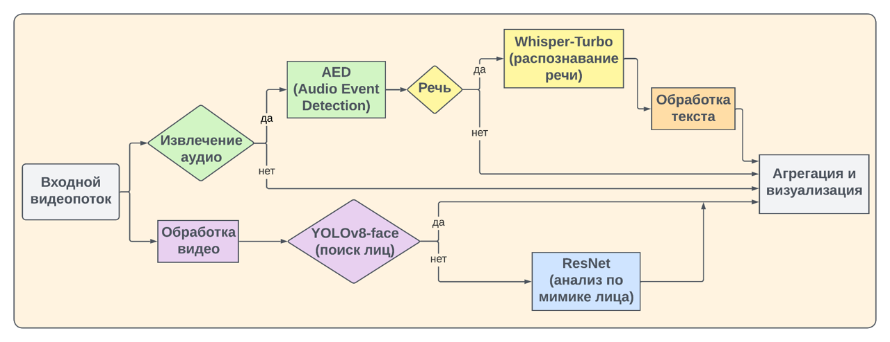

# Мультимодальный анализ эмоций

[](./LICENSE)

> **Внимание:** В репозитории отсутствуют большие файлы, веса моделей и обучающие датасеты. Для полноценной работы загрузите необходимые веса согласно инструкциям в подпроектах.

---

## Оглавление

- [Структура проекта (схематично)](#структура-проекта-схематично)
- [Установка весов моделей](#установка-весов-моделей)
- [Описание](#описание)
- [Используемые модели](#используемые-модели)
- [Установка зависимостей](#установка-зависимостей)
- [Как запускать](#как-запускать)
- [Требования](#требования)
- [Пример данных](#пример-данных)
- [Визуализация](#визуализация)

---

## Структура проекта (схематично)

```
├── README.md
├── LICENSE
├── requirements.txt
├── .gitignore
├── run.py                # Главный управляющий скрипт мультимодального анализа
├── main.py               # Пример использования аудиомодели (демо)
├── utils.py, video.py, audio.py, visualization.py
├── data/                 # Входные видео/аудио для анализа
│   ├── ...
├── results/              # (игнорируется) Результаты и визуализации
├── fed/                  # Модуль анализа эмоций по лицу (Face Emotion Detection)
│   ├── run.py
│   ├── processor.py
│   ├── models.py
│   ├── utils.py
│   ├── weights/          # (игнорируется) Веса моделей (ResNet, LSTM, YOLO)
│   └── ...
├── aed/                  # Модуль анализа эмоций по аудио (Audio Emotion Detection)
│   ├── run.py
│   ├── processor.py
│   ├── models.py
│   ├── pytorch/          # Архитектуры аудиомоделей
│   ├── utils/            # Вспомогательные скрипты и конфиги
│   ├── weights/          # (игнорируется) Веса моделей (Cnn14)
│   └── ...
├── ted/                  # Модуль анализа эмоций по тексту (Text Emotion Detection)
│   ├── run.py
│   ├── processor.py
│   ├── models.py
│   ├── weights/          # (игнорируется) Веса модели T5/FRIDA
│   └── ...
├── processors/           # Универсальный пайплайн и процессоры для мультимодального анализа
│   ├── pipeline.py
│   ├── audio_processor.py
│   ├── video_processor.py
│   ├── text_processor.py
│   ├── base_processor.py
│   └── ...
└── ...                   # Прочие вспомогательные файлы и директории
```

---

## Описание

Проект предназначен для автоматического анализа эмоций по видео, аудио и тексту. Используются три независимых модели:
- **FED** (Facial Emotion Detection) — анализ эмоций по лицу на видео.
- **AED** (Audio Emotion Detection) — анализ эмоций по аудиодорожке.
- **TED** (Text Emotion Detection) — анализ эмоций по транскрипции речи.

Каждая модель работает независимо, а результаты объединяются для получения наиболее вероятных эмоций в анализируемом фрагменте. Такой подход позволяет учитывать как визуальные, так и аудиальные и текстовые признаки, что повышает точность и устойчивость анализа.

Общая схема работы представлена ниже:

<p align="center">
  
</p>

## Используемые модели

### 1. Анализ эмоций по лицу (FED)

- **Архитектура:**
  - Для извлечения признаков с лиц используется сверточная нейросеть ResNet-50, обученная на датасете AffectNet (`weights/FER_static_ResNet50_AffectNet.pt`).
  - Для учета динамики эмоций во времени применяется LSTM (Long Short-Term Memory), веса — `weights/FER_dinamic_LSTM_Aff-Wild2.pt` (или аналогичные).
  - Для обнаружения лиц на кадрах видео используется модель YOLOv8 (`weights/yolov8l-face.pt`).

- **Классы эмоций:**
  - Нейтральность, Радость, Грусть, Удивление, Страх, Отвращение, Злость.

- **Принцип работы:**
  1. На каждом кадре видео обнаруживаются лица (YOLO).
  2. Для каждого лица извлекаются признаки (ResNet-50).
  3. Последовательность признаков анализируется LSTM для учета временного контекста.
  4. На выходе — вероятности по классам эмоций для каждого лица.

---

### 2. Анализ эмоций по аудио (AED)

- **Архитектура:**
  - Используется модель Cnn14 (вариант PANNs — Pretrained Audio Neural Networks), реализованная в `aed/pytorch/models.py` и обученная на датасете AudioSet.
  - Веса модели: `weights/cnn14.pth`.
  - Для обработки аудиосигнала используются спектрограммы и log-mel признаки.

- **Классы:**
  - Модель обучена на 527 классах звуков (AudioSet), но для анализа эмоций выделяются теги, связанные с речью и вокализацией (например, "Speech", "Shout", "Scream" и др.).

- **Принцип работы:**
  1. Аудио извлекается из видео (или подается отдельно).
  2. Модель Cnn14 предсказывает вероятности для всех классов.
  3. Для анализа эмоций используются только релевантные речевые теги.
  4. На основе тегов и их вероятностей делается вывод о наличии и типе эмоций.

---

### 3. Анализ эмоций по тексту (TED)

- **Архитектура:**
  - Используется энкодер T5 (`T5EncoderModel`) с дообученными весами (`weights/text_checkpoints/`, модель "FRIDA").
  - Для получения эмбеддингов текста и сравнения их с эмбеддингами эталонных эмоций применяется косинусное сходство.

- **Классы эмоций:**
  - Радость, Грусть, Гнев, Страх, Удивление, Отвращение, Нейтральность.

- **Принцип работы:**
  1. Аудио транскрибируется в текст (может использоваться внешний ASR).
  2. Текст преобразуется в эмбеддинг с помощью T5.
  3. Эмбеддинг сравнивается с эталонными векторами для каждой эмоции.
  4. На выходе — вероятности по классам эмоций.

---

### 4. Объединение результатов

- Все три модели могут работать независимо, но основной скрипт (`run.py` или пайплайн в `processors/pipeline.py`) объединяет их результаты для получения финального вывода о доминирующих эмоциях в видеофрагменте.
- Объединение происходит по принципу усреднения вероятностей или с учетом наличия/отсутствия данных по отдельным модальностям.

---

## Структура проекта

- `main.py` — пример использования модели Wav2Vec2 для аудиоэмоций (демо, не основной запуск).
- `run.py` — основной управляющий скрипт для мультимодального анализа (рекомендуется для запуска).
- `processors/` — пайплайн и процессоры для работы с видео, аудио и текстом.
- `fed/`, `aed/`, `ted/` — подпроекты для анализа по лицу, аудио и тексту соответственно, каждый содержит свой `run.py`.
- `data/` — папка с видео- и аудиофайлами для анализа.
- `results/`, `emotion_analysis.png`, `loss_curve.png`, `accuracy_curve.png` — результаты и визуализации.
- `visualization.py`, `utils.py`, `video.py`, `audio.py` — вспомогательные модули.

## Установка зависимостей

В проекте используются разные requirements для подпроектов:

- Для **AED** (`aed/requirements.txt`):
  ```
  matplotlib==3.0.3
  soundfile==0.10.3.post1
  librosa==0.6.3
  torchlibrosa==0.0.4
  ```
- Для **TED** и **FED** — зависимости указаны внутри подпроектов, могут потребоваться дополнительные библиотеки (`transformers`, `torch`, `opencv-python`, `deepface`, и др.).
- Для обработки видео — `ffmpeg` (должен быть установлен в системе).

Рекомендуется создать виртуальное окружение и установить все необходимые зависимости для каждого подпроекта отдельно.

## Установка весов моделей

> **Внимание!** Веса моделей не входят в репозиторий и должны быть скачаны вручную.
>
> 1. Перейдите по ссылке: [Google Drive — Model Weights](https://drive.google.com/drive/folders/1MvlSSqLlx2_cbnv9WGtdHwt7l3x5ytRP?usp=sharing)
> 2. Скачайте все содержимое.
> 3. Поместите скачанные файлы в соответствующие папки проекта:
>     - `wav2vec2_checkpoints/`
>     - `ted/weights/`
>     - `fed/weights/`
>     - `aed/weights/`
>
> Без этих файлов запуск моделей невозможен.

## Как запускать

### 1. Мультимодальный анализ (рекомендуемый способ)

```bash
python run.py
```
- Скрипт автоматически обработает все видеофайлы в папке `data/` и выведет/сохранит результаты.

### 2. Запуск отдельных моделей

#### Анализ эмоций по лицу (FED)
```bash
cd fed
python run.py --input_video <путь_к_видео> --output_video <путь_для_сохранения>
```

#### Анализ эмоций по аудио (AED)
```bash
cd aed
python run.py --audio <путь_к_аудио>
```

#### Анализ эмоций по тексту (TED)
```bash
cd ted
python run.py --audio <путь_к_аудио>
```
(Сначала извлекается аудио из видео, затем анализируется текстовая транскрипция.)

### 3. Использование пайплайна напрямую

Можно использовать пайплайн из `processors/pipeline.py` для обработки одного файла или интеграции в другие проекты.

## Требования

- Python 3.8+
- ffmpeg (для извлечения аудио из видео)
- torch, transformers, librosa, opencv-python, deepface и др. (см. requirements.txt в подпроектах)

## Пример данных

- В папке `data/` должны лежать видеофайлы (`.mp4`), которые будут анализироваться.
- Результаты сохраняются в виде json и визуализаций.

## Визуализация

- Скрипты в `processors/log_mel.py`, `processors/furie.py` — для визуализации аудиопризнаков и спектрограмм (образовательные/демонстрационные). 
